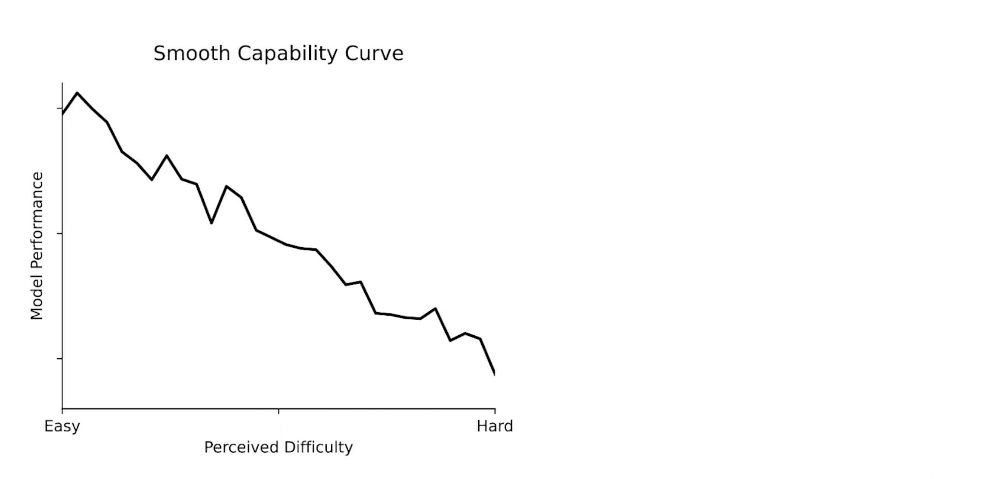
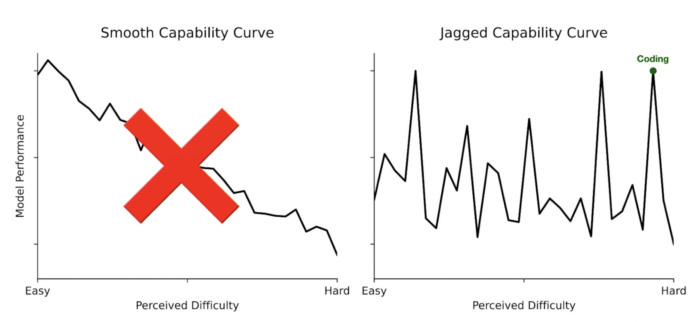
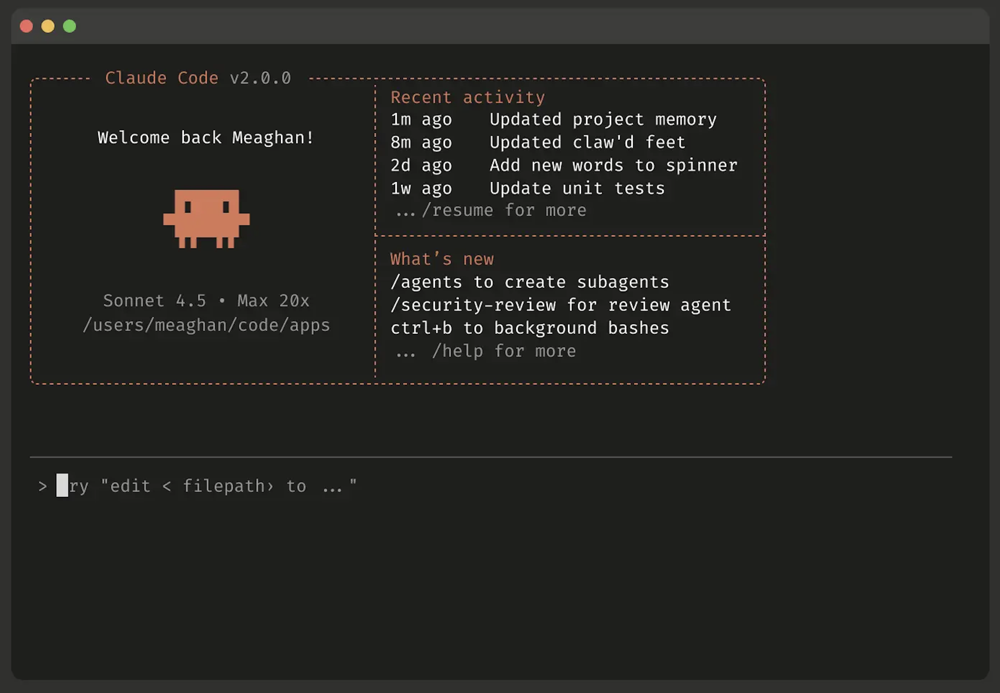
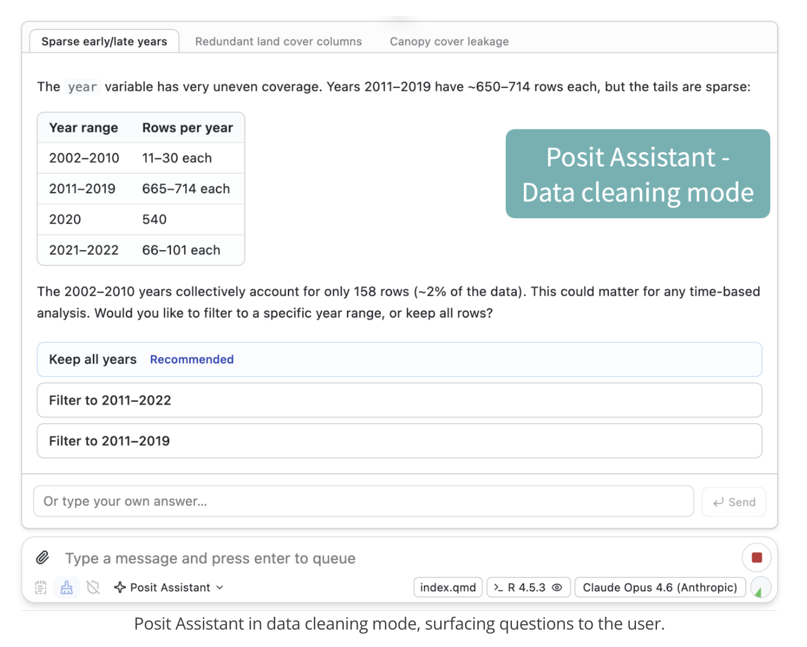
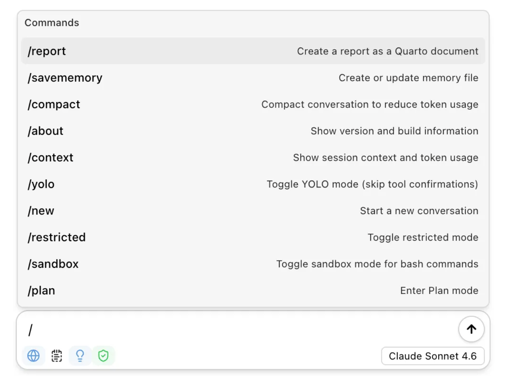

## Posit, open science, & the prime directive

::: columns
::: {.column width="50%"}

> Posit creates open-source software for data science, scientific research, and technical communication.

::: fragment
>  We build tools that prioritize correctness, transparency, and reproducibility in their output.
:::

:::

::: {.column width="50%"}

::: fragment
* Results are often generated via Excel, SPSS, JMP, etc., which can't be **verified** as **trustworthy**.
:::

::: fragment
* John M. Chambers coined the term "**the prime directive**": the obligation for analysts to produce work that can be **shown** to be **trustworthy**.
:::

:::
:::

## Fulfilling the prime directive

* ✅ **Correctness**: (Obviously)
* ✅ **Transparency**: methods of the analysis can be inspected
* ✅ **Reproducibility**: analysis can be repeated on the same data, hopefully yielding the same results

## LLMs: another opaque tool, but worse

::: columns
::: {.column width="50%"}
* ❌ **Correctness**: LLMs are infamous for giving convincing but wrong answers. 
* ❌ **Transparency**: Nobody really understands how or why LLMs do what they do. 
* ❌ **Reproducibility**: LLMs are non-deterministic black boxes.
:::

::: {.column width="50%"}
::: fragment
* With proper context and constraints, correctness can be improved (not guaranteed).
:::

::: fragment
* LLMs are _really good_ at coding, so they can produce verifiable results that can be vetted by humans.
:::
:::

:::

## LLM capabilities are _jagged_

You might expect performance to drop with difficulty...

{fig-align="center"}

## LLM capabilities are _jagged_

... but in reality, performance is jagged.

{fig-align="center"}

## The bad: counting / computing

> How many r's are in "strawberry"?

::: fragment
Most LLMs confidently answer **2**, but it's actually **3**.
:::

## The bad: counting / computing

> How many values are in this array `[4, 8, ...]`?

::: fragment
* Again, most LLMs confidently answer incorrectly.
:::

::: fragment
* That said, they definitely know how to **write code** to count!
:::

::: fragment
* LLMs don't come with the inherent capability to execute code, but it's excellent way for them to learn, be precise, and productive.
:::

::: fragment
* If the harness (i.e., context in which the LLM is operating) can **execute code**, then the LLM would get this right every time.
:::

# How do LLMs gain coding capabilities? {background-color="#0F3B5D"}

Through **tool calling**, which provides the foundation for **agents**.

# Agent = LLM + tools + loop

An LLM with tools (i.e., **functions**) running in a loop — deciding each next step from the last result.

## The good: coding assistants

::: columns
::: {.column width="40%"}

{fig-align="center"}
:::

::: {.column width="60%"}
* Claude Code, Codex, and Copilot etc: harnesses that allow LLMs to write and execute code.

::: fragment
* Primarily designed for software engineering tasks
:::

::: fragment
* IME, YOLO mode is **incredibly useful**, but also **terrifying**.
:::

::: fragment
* [Posit Assistant](https://assistant.posit.co/) brings a similar experience to data science, and designs for human-in-the-loop workflows.
:::
:::
:::

## Posit Assistant

::: columns
::: {.column width="65%"}
{fig-align="center"}
:::

::: {.column width="35%"}
* Can access and control your Python/R sessions
:::
:::

## Posit Assistant

::: columns
::: {.column width="65%"}
{fig-align="center"}
:::

::: {.column width="35%"}
* Can access and control your Python/R sessions

* Helpful features for doing data science

:::
:::

## Posit Assistant

::: columns
::: {.column width="65%"}

<wistia-player media-id="pb1lqtpnnv" aspect="1.701851851851852"></wistia-player>
:::

::: {.column width="35%"}
* Can access and control your Python/R sessions

* Helpful features for doing data science

* Tight integration with Positron, Notebooks, etc.

:::
:::

## Posit Assistant

::: columns
::: {.column width="65%"}
{fig-align="center"}
:::

::: {.column width="35%"}
* Can access and control your Python/R sessions

* Helpful features for doing data science

* Tight integration with Positron, Notebooks, etc.

* Synthesize findings into reproducible reports, etc.
:::
:::

::: fragment
**NOTE**: Posit Assistant _helps you_ do analysis -- what about _helping others_ leverage your work?
:::

## Querychat: ask more of your dashboards

::: columns
::: {.column width="60%"}

<wistia-player media-id="at01coepkh" aspect="1.701851851851852"></wistia-player>
:::

::: {.column width="40%"}
* Web app framework for building AI assisted data exploration apps  

::: fragment
* Restricted to SQL/[ggsql](https://ggsql.org/) queries for safety
:::

::: fragment
* Supplies context from data you provide
:::

::: fragment
* Limited scope can lead to more correct answers, but less creative ones
:::

:::
:::

## Goals for today {background-color="#0F3B5D"}

1. Learn the basics of programming with LLMs (via **chatlas**).
    * System prompts, tool calling, etc.

::: fragment
2. Learn the basics of **shinychat**, which makes it easy to build LLM-powered web apps.
    * Plus some useful things for putting apps into production 
:::

::: fragment
3. Form a mental model for how these things serve as the foundation for **querychat**.
    * Hopefully this provides inspiration to create a tailored LLM-powered app for your own work.
:::
