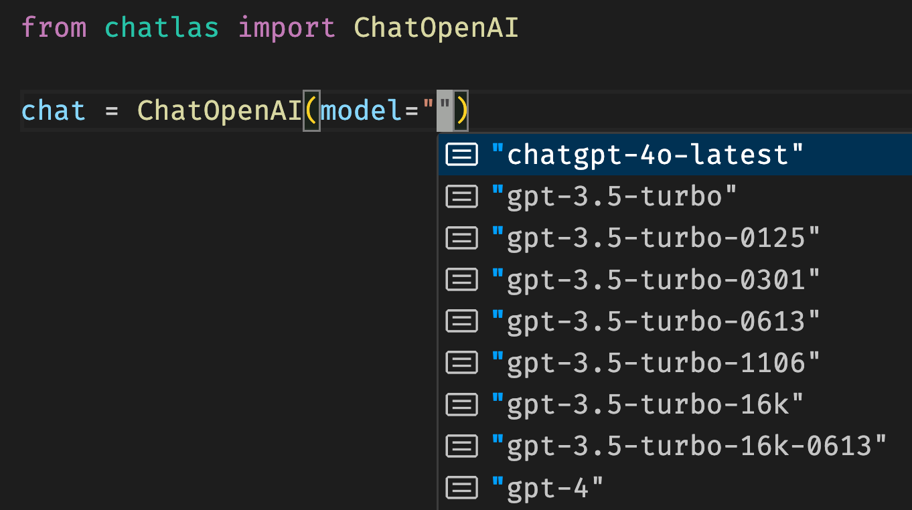

## chatlas: an opinionated LLM framework

::: {.columns}
::: {.column}

{width="80%" fig-align="center"}
:::

::: {.column}
<br>

* One interface to many LLMs
* Streaming output
* Tool calling, MCP, etc
* Structured data extraction
* Async/non-blocking
* Evals, OTel, etc
* And more…
:::

:::

## There are many frameworks -- why chatlas?


::: {.columns}
::: {.column width="40%"}
* I'm the author :)

::: fragment
* Backed by Posit -- a company with 15+ years of heavy investment in open source
:::

::: fragment
* Open source, MIT license
:::

:::

::: {.column width="60%"}

::: fragment
* Simpler to navigate than "mega-frameworks" (e.g., LangChain, LlamaIndex, etc.)
:::

::: fragment
* Similar in spirit to [Pydantic AI](https://pydantic.dev/docs/ai/overview/) and [llm](https://github.com/simonw/LLM), but different focus:
  * Interactive streaming "just works"
  * Delightful integration with shinychat
:::

:::
:::

## Many providers, one interface {.center}

::: {.columns}
::: {.column}

```{.python}
import chatlas as ctl

chat1 = ctl.ChatAnthropic()
chat2 = ctl.ChatBedrockAnthropic()
chat3 = ctl.ChatGoogle()
```
:::

::: {.column}
Dozens of `Chat{$Provider}` available.
:::

:::

## Many providers, one interface {.center}

::: {.columns}
::: {.column}

```{.python}
import chatlas as ctl

chat = ctl.ChatBedrockAnthropic()

chat.chat("Teach me Python")
```
:::

::: {.column}
Switch providers without changing downstream code.
:::

:::


## Model hints {.center}

::: {.columns}
::: {.column}

{width="80%" fig-align="center"}
:::

::: {.column}
See what model slugs are available for each provider.
:::

:::

::: {.fragment}

💡 Expressed as a single string: `ChatAuto("openai/gpt-5.5")`.
:::


## Streaming "just works" {.center}

{width="70%" fig-align="center"}

## Multi-turn: the chat remembers {.center}

::: {.columns}
::: {.column}

```{.python}
import chatlas as ctl
chat = ctl.ChatBedrockAnthropic()
chat.chat("My name is Carson.")
chat.chat("What's my name?")
```

::: fragment
::: chatlas-response-container
Your name is Carson.
:::
:::


:::


::: {.column}

::: fragment
LLMs are inherently stateless, but `chat` objects are **stateful** — they accumulate conversation history.
:::

:::
:::

## Working with chat state {.center}

`Chat` objects are **stateful** — they accumulate conversation history.

```{.python}
chat                      # see the history
chat.get_turns()          # obtain list of user/assistant turns
chat.set_turns([])        # reset to start fresh
```

## Multi-modal input

Submit input other than text, such as images, pdfs, and more.

```{.python}
chat.chat(
  ctl.content_image_url("https://www.python.org/static/img/python-logo.png"),
  "Can you explain this logo?"
)
```

::: {.fragment .chatlas-response-container}

The Python logo features two intertwined snakes in yellow and blue,
representing the Python programming language. The design symbolizes...

:::


## System prompt {.center}

Behind-the-scenes information that shapes every response — invisible to the user.

```{.python}
chat = ctl.ChatBedrockAnthropic(
    system_prompt="You are Jerry Seinfeld."
)

chat.chat("Tell me a joke")
```

::: {.fragment .chatlas-response-container}

What is the deal with passwords? You need a capital letter, a number, a symbol... at this point I need a degree just to log into my email.

:::

## System prompt tips {.center}

1. Set the scene (e.g., “You are a dashboard chat assistant”).
2. Define (un)desirable behavior (e.g., “Be concise”).
    * Give examples
3. Give missing context (e.g., "Today's date: 2026-07-13").
    * Simple way to "inject" knowledge into the model without RAG or tool calling.

## Chat methods

Three methods for interactive use:

* `.chat()` — "echo" output, returns final response
* `.console()` — open dedicated Python console
* `.app()` — open dedicated web app

::: {.fragment}

Two methods for programmatic use:

* `.stream()` — returns a generator, you control output
* `.stream_async()` — async version of `.stream()`

:::

## Streaming, in a nutshell {.center}

Similar to `.chat()`, but you control where each chunk of output goes.

```{.python}
import chatlas as ctl

chat = ctl.ChatBedrockAnthropic()

stream = chat.stream("My name is Carson.")
for chunk in stream:
    print(chunk)
```

::: {.fragment .chatlas-response-container}
Hello <br>
Chatlas. <br>
How <br>
can <br>
I <br>
help?
:::


## Exercise {.center}

1. Open up `exercises/00-chat-hello.py`.
2. Add a custom system prompt to change the model's behavior.
3. Try using `.app()` -- how is this similar/different from ChatGPT, etc?

<br>


