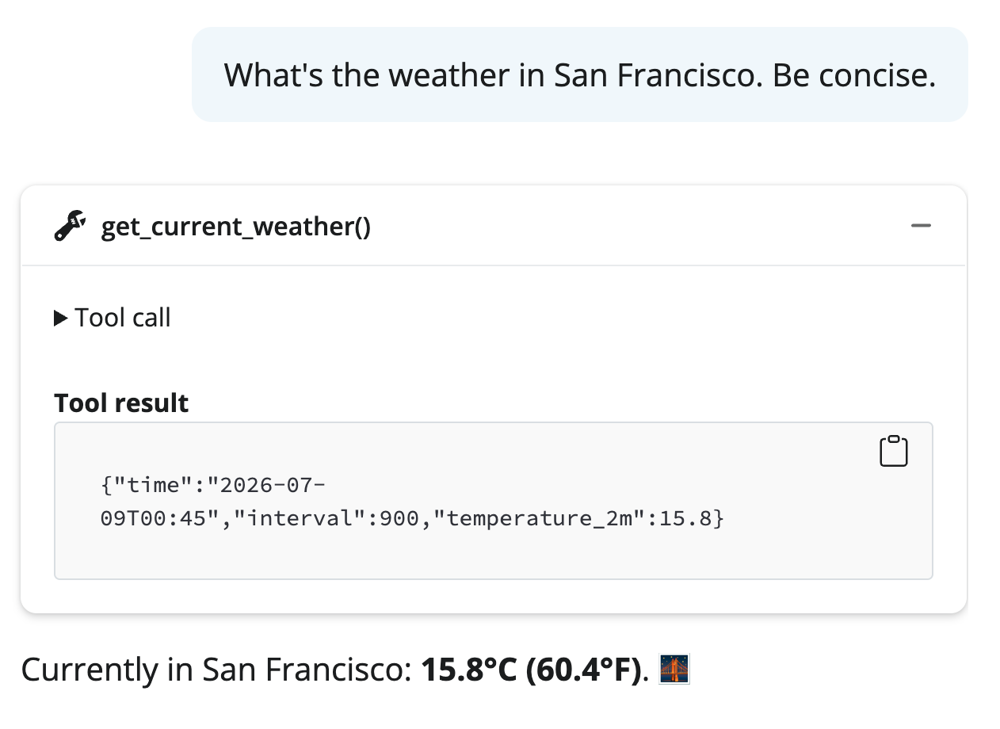
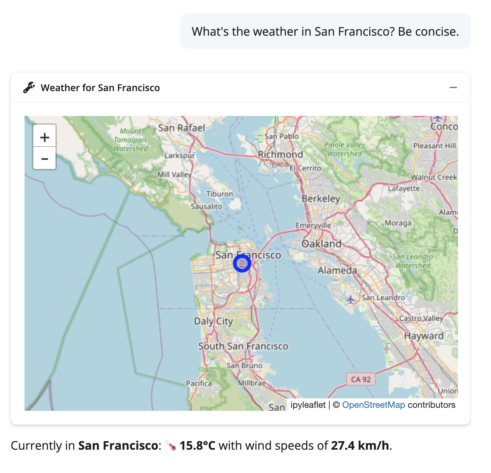

## Recap: the `.app()` method

* We've already seen `chat.app()` -- a **working chatbot** in 1 line of code.

::: fragment
* Under the hood, it uses [`shinychat`](https://posit-dev.github.io/shinychat/py/)  --  a **chat UI** built on [Shiny](https://shiny.posit.co/py/).
:::

::: fragment
* `chatlas` + `shinychat` provides a delightful UX, but you could also:
  1. Use `chatlas` with your own frontend (e.g., Streamlit, FastAPI, etc.)
  2. Use `shinychat` with your own backend (e.g., LangChain, Pydantic AI, etc.)
:::

## `shinychat`: high-level API

`.app()` is a thin wrapper around `shinychat`. It's basically just:

<br>

::: columns
::: {.column width="50%"}
```{.python}
import chatlas as ctl
from shinychat.express import Chat

chat = Chat(
  "chat", 
  client=ctl.ChatBedrockAnthropic()
)

chat.ui()
```
:::

::: {.column width="50%"}

::: fragment
* `client=` is what wires up all the chat features (automatically).
:::


::: fragment
* This lets you easily drop a chat UI in a larger Shiny app.
:::

:::
:::

## `shinychat`: low-level API

`shinychat` has a low-level API that gives you **full control** over the chat.

<br>

```{.python}
import chatlas as ctl
from shinychat.express import Chat

chat = Chat("chat")
chat.ui()
client = ctl.ChatBedrockAnthropic()

@chat.on_user_submit
async def handle_user_input(user_input: str):
    # This next line could also be a LangChain chain, 
    # Pydantic AI call, or any generator.
    response = await client.stream_async(user_input)
    await chat.append_message_stream(response)
```

## What `client=` gives you for free


- ✅ **History** (multiple conversations)
- ✅ **Tool calling** with display
- ✅ **Async streaming** responses
- ✅ **Cancel** mid-generation
- ✅ **File attachments** (images, PDFs)
- ✅ **Multi-turn** conversation
- ✅ Automatic **error** handling

## shinychat: tool displays

{fig-align="center"}

## shinychat: custom tool displays

{fig-align="center"}

## shinychat: custom tool displays

**Main idea**: Return `ContentToolResult` with a `ToolResultDisplay`.


::: fragment
```{.python}
import chatlas as ctl
from shinychat.types import ToolResultDisplay

def my_tool():
    return ctl.ContentToolResult(
        value="value for the LLM",
        extra={
            "display": ToolResultDisplay(
                title="Custom title for the user",
                icon="maybe an icon here",
                html="<b>HTML content for the user</b>",
            )
        }
    )
```
:::

::: fragment
`shinychat` uses this to display rich tables and visualizations in the chat. The LLM sees the raw data, user sees a polished display.
:::


## Beyond chat

We often associate LLMs with chat, but they can be used for **any interactive app**.

We won't dwell on this, but here are a couple examples:

1. [Invoice data extractor](https://shiny.posit.co/py/docs/genai-structured-data.html#populating-inputs)
2. [Workout generator](https://shiny.posit.co/py/templates/workout-plan/)


## Feature tour {.center}

::: {.columns}
::: {.column width="33%"}

### Slash commands

```{.python}
@chat.slash_command(
    "help",
    "Show help"
)
async def _():
    await chat.append_message(
        "Here's how to use me..."
    )
```

:::
::: {.column width="33%"}

### Input suggestions

```{.python}
await chat.append_message(
    ui.HTML("""
    Try asking:
    <ul>
      <li><span class='suggestion'>
        Summarize the data
      </span></li>
      <li><span class='suggestion'>
        Show a bar chart
      </span></li>
    </ul>
    """)
)
```

:::
::: {.column width="34%"}

### Attachments

```{.python}
# Enabled automatically
# when client= is set.
#
# Or restrict to specific
# file types:
chat.ui(
    allow_attachments=[
        "image/png",
        "application/pdf",
    ],
)
```

:::
:::

::: notes
Quick flyby — don't demo all of these, just show they exist. Slash commands
are great for power-user shortcuts. Input suggestions (clickable chips) are
great for guiding users who don't know what to ask. Attachments are free with
the chatlas client.

Point out the suggestion pattern: wrapping text in
`<span class='suggestion'>` makes it clickable. Adding the `submit` class
auto-submits it. A `<ul>` of suggestion items renders as a card grid.
:::

## Custom tool displays {.center}

By default, tool results show as collapsible text. But you can make them **beautiful**.

::: {.placeholder style="min-height: 350px;"}
SCREENSHOT: side-by-side comparison —<br>
(left) default tool result display (plain collapsible text)<br>
(right) custom ToolResultDisplay with icon, title, and formatted markdown
:::

::: notes
This is the main teaching point of the shinychat section. When a chatlas tool
runs, the result shows up in the chat as a collapsible block. That's fine for
debugging, but for end users you want something polished. ToolResultDisplay
lets you control exactly how it looks.

Show the default first, then show the custom version. The contrast is the
motivator.
:::

## Building a tool display {.center}

```{.python}
from chatlas import ContentToolResult
from shinychat.types import ToolResultDisplay
import faicons

def get_weather(lat: float, lng: float, location: str) -> ContentToolResult:
    """Get the current weather for a location.
    ...
    """
    data = call_weather_api(lat, lng)
    return ContentToolResult(
        value=data,                                  # what the LLM sees
        extra={
            "display": ToolResultDisplay(
                title=f"Weather: {location}",
                icon=faicons.icon_svg("cloud-sun"),
                markdown=f"**{data['temp']}°C** — {data['condition']}",
            )
        },
    )
```

::: notes
Walk through the anatomy:

1. Return type is `ContentToolResult`, not a plain value.
2. `value=` is what the LLM sees — it still needs the raw data to reason about.
3. `extra={"display": ToolResultDisplay(...)}` is what the *user* sees in the
   chat UI. The LLM never sees this.
4. `title` and `icon` appear in the collapsed header. `markdown` (or `html` or
   `text`) is the expanded body.

Other useful params: `full_screen=True` adds an expand button (great for
charts/tables), `open=True` starts expanded, `footer` for attribution.
:::

## Tool display in action {.center}

::: {.placeholder style="min-height: 400px;"}
SCREENSHOT: a shinychat conversation showing a custom tool display —<br>
the weather card with icon, title, and formatted content<br>
embedded naturally in the chat flow
:::

::: notes
If you've got time, live-demo this. Otherwise, show the screenshot.
The key insight: the chat feels like a polished product, not a developer tool.
This is the difference between a prototype and something you'd hand to a
stakeholder.
:::
