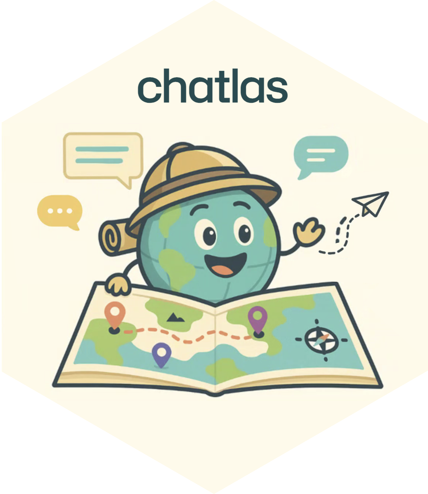
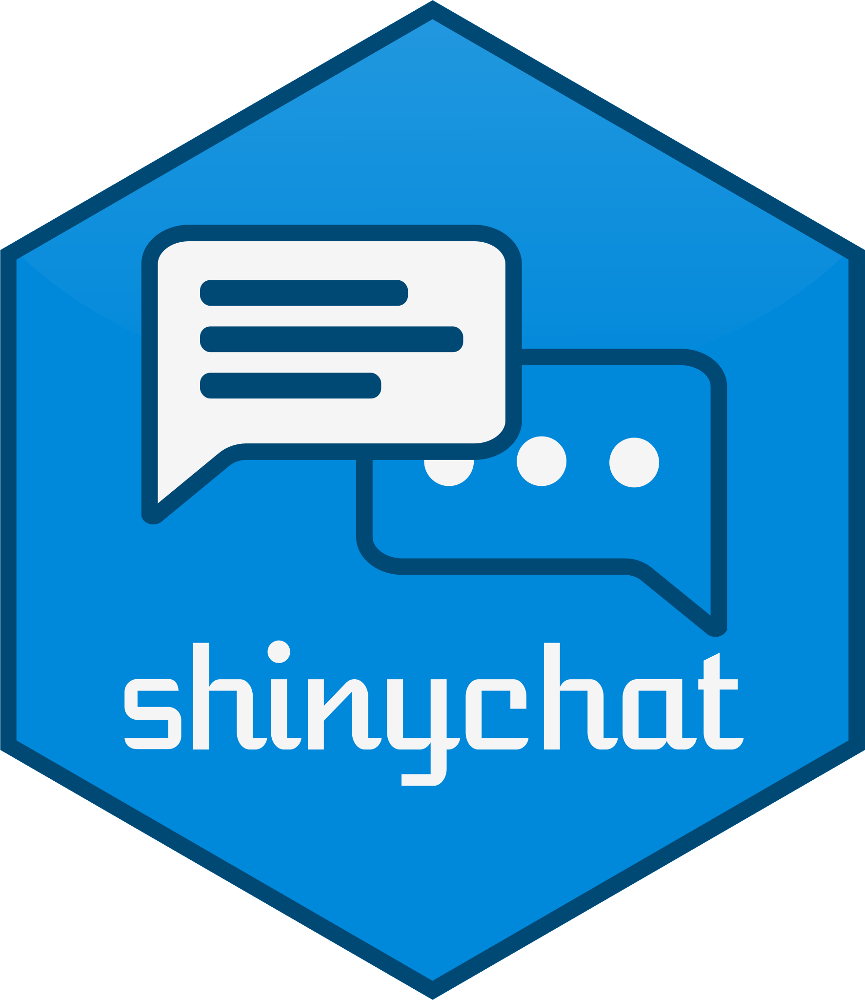
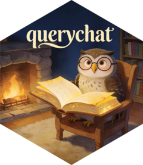

## What we built today {.center}

| | Section | Key idea |
|:-:|---|---|
| 🧭 | **Foundations** | Focus LLMs on strengths, engineer around the rest |
| {height="45px"} | **chatlas** | One API for any LLM — chat, tools, streaming |
| {height="45px"} | **shinychat** | 5 lines to a chatbot with tool displays |
| {height="45px"} | **querychat** | Self-service analytics, safe by architecture |

: {tbl-colwidths="[10,25,65]"}

::: notes
Callback to the "what we'll build today" slide from the welcome deck. Walk
through each row and remind them of the key takeaway. The arc: from "how to
think about LLMs" to "a deployed analytics app" in 4 hours.
:::

## The recipe {.center}

::: {style="font-size: 1.5em; line-height: 2;"}

1. Focus LLMs on **language → code**
2. Give them **tools** and **context**
3. Keep **humans in the loop**

:::

That's it. Context engineering + tools + verification.

No RAG. No multi-agent. No fine-tuning.

::: notes
Repeat the thesis from the foundations section. The whole tutorial was an
exercise in showing how far you can get with these three simple principles.
querychat is the proof: a production-ready analytics platform built entirely
on context engineering (auto-generated schema) + tools (filter, query,
visualize) + human-in-the-loop (verifiable SQL, reactive dashboards).
:::

## Where to go from here {.center}

::: {.columns}
::: {.column width="33%"}

### 📚 Docs

- [chatlas](https://posit-dev.github.io/chatlas/)
- [shinychat](https://posit-dev.github.io/shinychat/py/)
- [querychat](https://posit-dev.github.io/querychat/py/)
- [Shiny GenAI guide](https://shiny.posit.co/py/docs/genai-chatbots.html)

:::
::: {.column width="33%"}

### 💬 Community

- GitHub Issues on each repo
- [Posit Community Forum](https://forum.posit.co/)
- Discord / Shiny community

:::
::: {.column width="34%"}

### 🧪 Next steps

- Deploy to **Connect Cloud**
- Add **OTel** observability
- Try **structured output** + **MCP**
- Explore the **visualize** tool

:::
:::

::: notes
Don't rush this — people want the links. Have the slide up while you talk
through each column briefly. The "next steps" column plants seeds for things
they can explore after the tutorial.
:::

## Feedback {.center}

::: {.placeholder style="min-height: 300px;"}
QR CODE: link to feedback survey 
(generate via your preferred QR tool)
:::

Your feedback makes the next tutorial better.

::: notes
TODO(Carson): create the feedback survey and generate the QR code.
Give them 60 seconds to scan and start filling it out while you're still
at the front. People who leave the room first never fill out the survey.
:::

# Thank you! 🎉 {.center background-color="#0e3b5c"}

::: {style="color: white; font-size: 0.9em;"}
Carson Sievert · Posit

All materials: **[short link TBD]**
:::

::: notes
Thank them for their time. Remind them all materials (slides, exercises, code)
are public and linked. Stick around for questions.
:::
