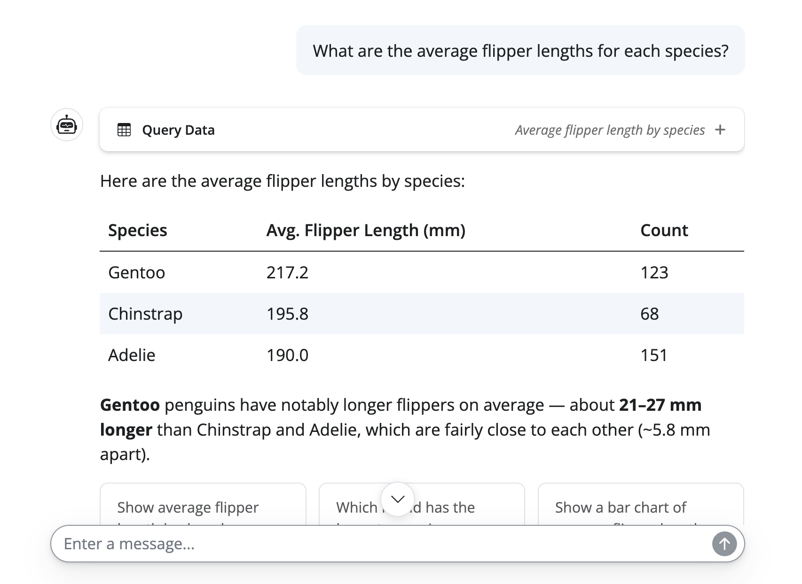
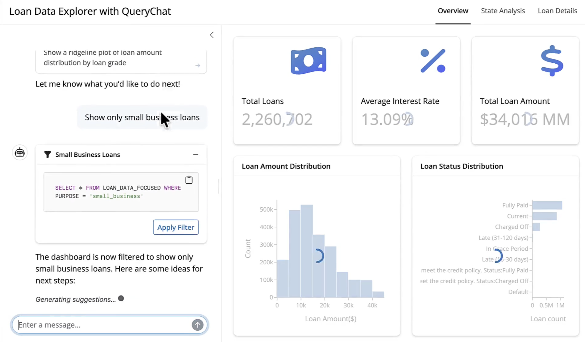
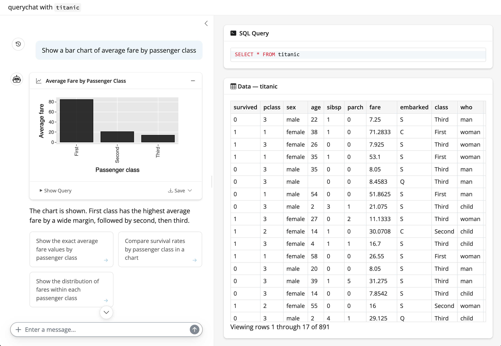

## 

<script src="https://fast.wistia.com/player.js" async></script>
<script src="https://fast.wistia.com/embed/at01coepkh.js" async type="module"></script>
<style>wistia-player[media-id='at01coepkh']:not(:defined) { background: center / contain no-repeat url('https://fast.wistia.com/embed/medias/at01coepkh/swatch'); display: block; filter: blur(5px); padding-top:58.76%; }</style>

<wistia-player media-id="at01coepkh" aspect="1.701851851851852"></wistia-player>


## Three tools: visualize, query, filter

::: columns
::: {.column width="60%"}
{width="100%" fig-align="center"}
:::

::: {.column width="40%"}
1. **Visualize:** execute ggsql queries, rendered as visualizations in the chat.
:::
:::

## Three tools: visualize, query, filter

::: columns
::: {.column width="60%"}
{width="100%" fig-align="center"}
:::

::: {.column width="40%"}
1. **Visualize:** execute [ggsql](https://ggsql.org/) queries, rendered as visualizations in the chat.
2. **Query:** execute SQL queries, rendered as tables/text in the chat.
:::
:::


## Three tools: visualize, query, filter

::: columns
::: {.column width="60%"}
{width="100%" fig-align="center"}
:::

::: {.column width="40%"}
1. **Visualize:** execute ggsql queries, rendered as visualizations in the chat.
2. **Query:** execute SQL queries, rendered as tables/text in the chat.
3. **Filter:** execute filter SQL queries on predetermined views, allowing the LLM to reactively drill into the data in response to user questions.
:::
:::

::: fragment
**Note**: all three require only read-only access to the data.
:::

## Get started

::: columns
::: column
```{.python filename="app.py"}
from querychat import QueryChat
from querychat.data import titanic

qc = QueryChat(
  titanic(), 
  "titanic",
  client="bedrock-anthropic",
  tools=("filter", "query", "visualize"),
)
```
:::

::: column
1. Supply a [data source](https://posit-dev.github.io/querychat/py/data-sources.html), LLM client, and tools to enable.

::: fragment
2. `QueryChat` auto-generates a system prompt with schema context and instructions for the LLM.
:::

::: fragment
3. Users can also provide a [data dictionary](https://posit-dev.github.io/querychat/py/context.html#data-dictionary) to further guide the LLM.
:::
:::
:::


## The pre-bundled app

::: columns
::: {.column width="40%"}

```{.python filename="app.py"}
from querychat import QueryChat
from querychat.data import titanic

qc = QueryChat(...)

app = qc.app()
```
<br>

```bash
shiny run app.py
```

:::

::: {.column width="60%"}
{width="100%" fig-align="center"}
:::

:::

::: fragment
Useful for your own exploration, but for sharing with others, you'll probably want to build a **custom dashboard**.
:::


## A basic custom dashboard

::: columns
::: {.column width="50%"}

```{.python filename="app.py"}
from shiny.express import render, ui
from querychat.express import QueryChat
from querychat.data import titanic

qc = QueryChat(titanic(), "titanic")
qc.sidebar()

with ui.card():
    @render.data_frame
    def data_table():
        return qc.df()
```

:::

::: {.column width="50%"}
* This is essentially what `qc.app()` does under the hood.

::: fragment
* `qc.sidebar()` places the chat in a sidebar.
:::

::: fragment
* `qc.df()`: a **reactive** value containing the filtered dataset.
:::

::: fragment 
* Shiny provides best UX, but you can also use Streamlit, Dash, or Gradio.
:::

:::

:::

## Exercise {.center background-color="#0F3B5D"}

1. Open `exercises/querychat-app.py` and run it.
    * Can press run button in Positron or run `shiny run exercises/querychat-app.py` in terminal.
2. Interact with the app enough to trigger all three tools. How do the tool call displays differ for each tool? 
3. Remove the `"visualize"` tool and add `print(qc.system_prompt)`. 
    * What do you notice in the system prompt?
    * When does the LLM gain context (if any) about the data?

<br>



## Multiple tables

::: columns
::: column

```{.python}
from querychat import QueryChat
from querychat.data import titanic, tips

qc = QueryChat(
  client="bedrock-anthropic",
  tools=("filter", "query", "visualize"),
)

qc.add_table(titanic(), "titanic")
qc.add_table(tips(), "tips")
```

:::

::: column
* Supports multiple tables, each with its own schema context.

::: fragment
* Stuffing all that context into a single system prompt doesn't scale well
:::

::: fragment
* Instead, querychat uses a **tool-based approach**: the LLM calls a tool to get schema context for a specific table.
:::

::: fragment
* BTW, a wide variety of data sources are supported: pandas, polars, ibis, sqlalchemy, etc.
:::

:::
:::


## Custom clients & tools

::: columns
::: column

```{.python}
import chatlas as ctl
from querychat import QueryChat
from querychat.data import titanic

client = ctl.ChatBedrockAnthropic()
client.register_tool(ctl.tool_web_search())

qc = QueryChat(client=client)
qc.add_table(titanic(), "titanic")
```
:::

::: column
* Supply your own `client` to `QueryChat` to add custom tools, like a web search tool.
:::
:::


## Exercise {.center background-color="#0F3B5D"}

1. Open `exercises/querychat-custom-app.py` and run it.
2. Follow the instructions at the top of the file to customize it.

<br>

