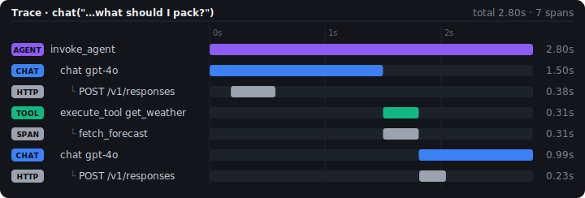

## Shipping raises new questions

- So your chatbot works for you, but are you sure it's working correctly in production?

::: fragment
- Even if you test extensively, users may encounter undiscovered issues.
:::

::: fragment
- Collecting telemetry data from your app in production helps you answer questions like:
  - Are users encountering errors?
  - Is the LLM performing as expected?
  - What are users asking?
:::

::: fragment
- **OpenTelemetry** (OTel) is an open standard collecting information about your app's behavior.
:::

## OpenTelemetry, briefly

- A vendor-neutral, open standard for collecting traces, metrics, and logs from an app.

::: fragment
- Instrument once, view anywhere -- [Logfire](https://logfire.pydantic.dev/), [Datadog](https://www.datadoghq.com/), etc. all speak OTel.
:::

::: fragment
- `chatlas` is instrumented with OTel out of the box -- no tracing code to write yourself, just choose where to send the data.
:::

::: fragment
- That said, you can also add your own spans to capture additional information about your app's behavior
    - e.g., tool execution, database queries, etc.
:::

::: fragment
- Shiny is also instrumented with [OTel](https://shiny.posit.co/py/docs/opentelemetry.html), so you can see the full picture of your app's behavior.
:::

## Two concepts: span & trace

- A **span** is one timed unit of work -- one model call, one tool execution -- with a name and key/value attributes.
- A **trace** is a tree of spans: the full path of one request, each nested under the one that triggered it.

::: fragment
A single `chat()` that calls a tool produces a trace shaped like this:

```
invoke_agent                      # wraps the full chat loop
├── chat gpt-4o                   # each model API call
├── execute_tool get_weather      # each tool invocation
├── chat gpt-4o                   # follow-up model call
└── ...
```
:::

## Quick start: console output

Emit traces to the console:

```{.python filename="otel_config.py"}
from opentelemetry import trace
from opentelemetry.sdk.trace import TracerProvider
from opentelemetry.sdk.trace.export import ConsoleSpanExporter, SimpleSpanProcessor

provider = TracerProvider()
provider.add_span_processor(SimpleSpanProcessor(ConsoleSpanExporter()))
trace.set_tracer_provider(provider)
```

<br>

::: fragment
```{.python filename="app.py"}
import otel_config 
import chatlas as ctl

chat = ctl.ChatBedrockAnthropic()
chat.app()
```
:::

## Visualize traces

A service like [Logfire](https://logfire.pydantic.dev/) is free to start and provide a nice UI for viewing traces.

```{.bash}
pip install logfire
logfire auth
```

Add this to your app:

```{.python filename="app.py"}
import logfire
logfire.configure()
```

::: fragment
Or, the more generic OTel env vars works with many backends...

```{.bash}
OTEL_EXPORTER_OTLP_ENDPOINT="https://logfire-eu.pydantic.dev"
OTEL_EXPORTER_OTLP_HEADERS="Authorization=<your-write-token>"
OTEL_SERVICE_NAME="my-chatlas-app"
```

...also nice you don't need to touch app code ^^^
:::

## Visualize traces

{fig-align="center"}

::: fragment
- Read top to bottom: the model decides to call the tool (blue), the tool runs (green), and a follow-up model call answers (blue).
:::

::: fragment
- Here there is also custom instrumentation for HTTP traffic as well as the tool call (gray).
:::

## Example: custom spans

```{.python}
from opentelemetry import trace
from opentelemetry.instrumentation.httpx import HTTPXClientInstrumentor
from chatlas import ChatBedrockAnthropic

HTTPXClientInstrumentor().instrument()  # nests the HTTP call under `chat`
tracer = trace.get_tracer("travel_assistant")

def get_weather(city: str) -> str:
    with tracer.start_as_current_span("fetch_forecast"):
        return f"{city}: 14°C, light rain, breezy this weekend."

chat = ChatBedrockAnthropic()
chat.register_tool(get_weather)
chat.chat("I'm headed to Tokyo this weekend — what should I pack?")
```

{height="200px" fig-align="center"}

## What's captured

| Span | Captures |
|---|---|
| **invoke_agent** -- the whole chat loop | Provider, requested model |
| **chat** -- one per model call | Provider/model, token usage, response id |
| **execute_tool** -- one per tool call | Tool name, description, call id, errors |

::: fragment
- Attribute names follow the [OTel GenAI semantic conventions](https://opentelemetry.io/docs/specs/semconv/gen-ai/) (`gen_ai.*`) -- the same names other GenAI-instrumented libraries use.
:::

::: fragment
- Since message content may contain sensitive data, it is **not** captured by default. You can opt-in to capture it if you want.

```{.bash}
OTEL_INSTRUMENTATION_GENAI_CAPTURE_MESSAGE_CONTENT=true
```
:::


## Going deeper (optional)

`chatlas`'s spans describe the *shape* of a conversation. To see *inside* each step -- raw HTTP, retries, full payloads -- add a lower-level instrumentor:

| Level | Example | Tradeoff |
|---|---|---|
| **Transport** | `httpx` instrumentation | Works with every provider; generic HTTP spans only |
| **SDK, model-agnostic** | [OpenLLMetry](https://github.com/traceloop/openllmetry) | GenAI-aware spans across many providers |
| **Official, per-provider** | e.g. `opentelemetry-instrumentation-anthropic` | Most detail; one package per SDK |

::: fragment
- Start with `httpx` (you just saw it) -- reach for the others only if you need GenAI-specific attributes `chatlas` doesn't already give you.
:::

::: notes
Don't dwell here -- 30 seconds max. The point is just that more detail is
available if they need it; most people in this room will never need more
than the framework-level spans chatlas gives them for free.
:::

## Exercise

- Add `otel_config.py` (the console version above) to your `exercises/` folder, then add `import otel_config` as the very first line of `shinychat-app.py`.
- Chat with it and watch spans print in your terminal.
- **Bonus**: wrap `get_weather()` in a custom span, like the `travel_assistant` example.

>}}